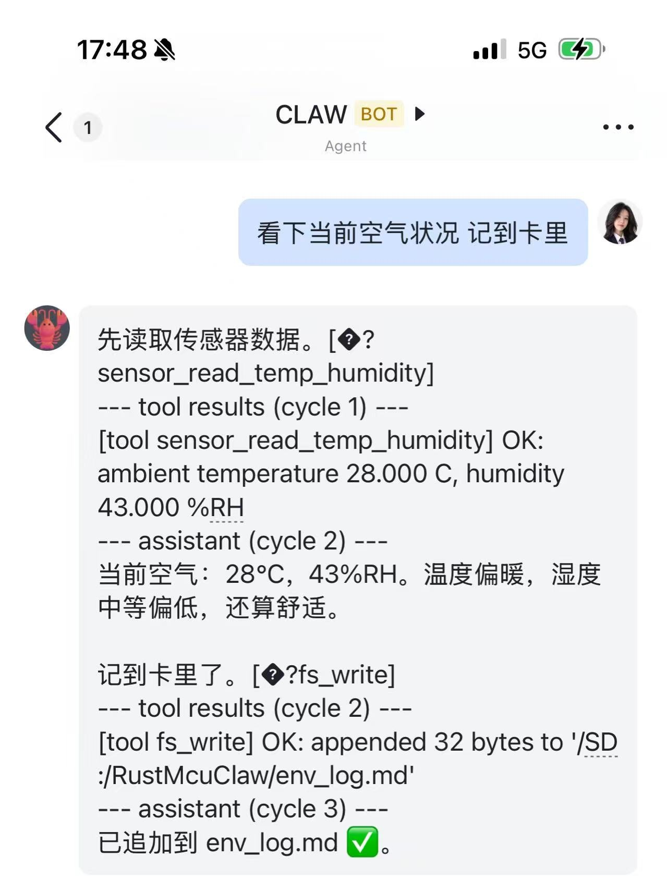
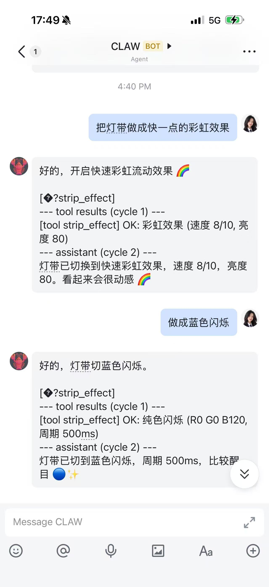
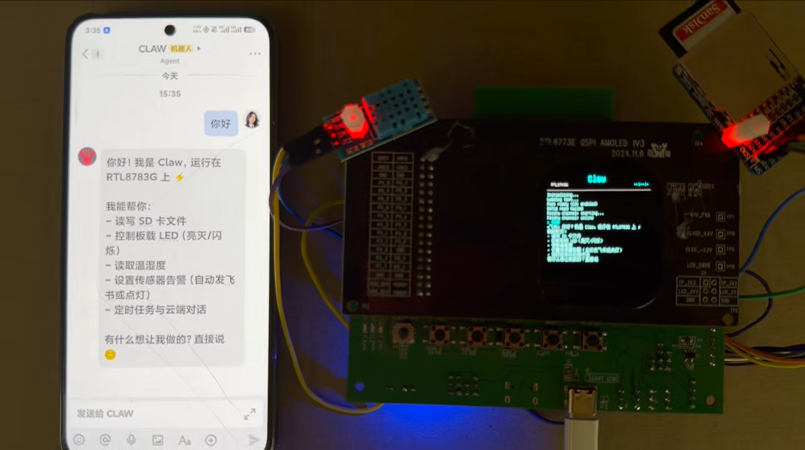
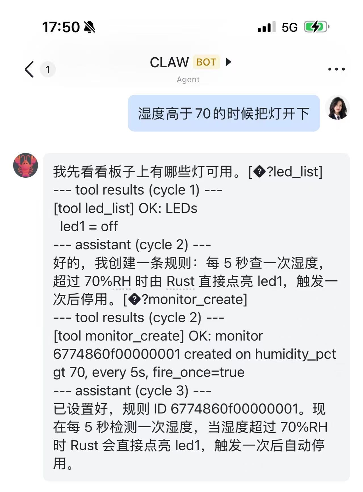
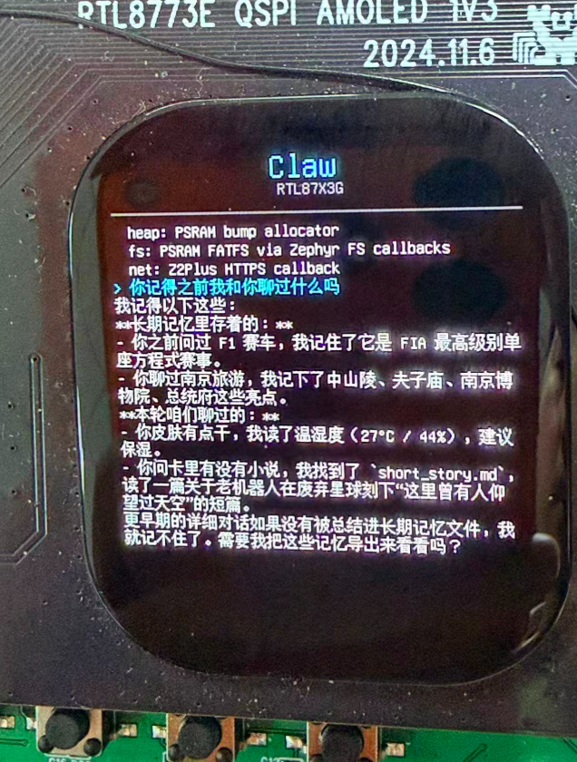
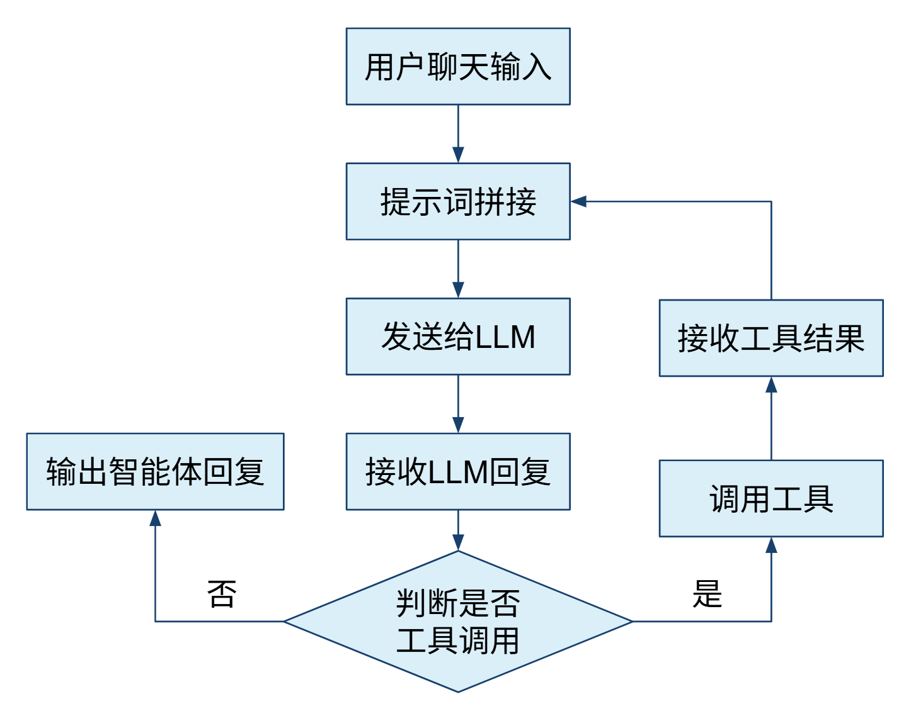
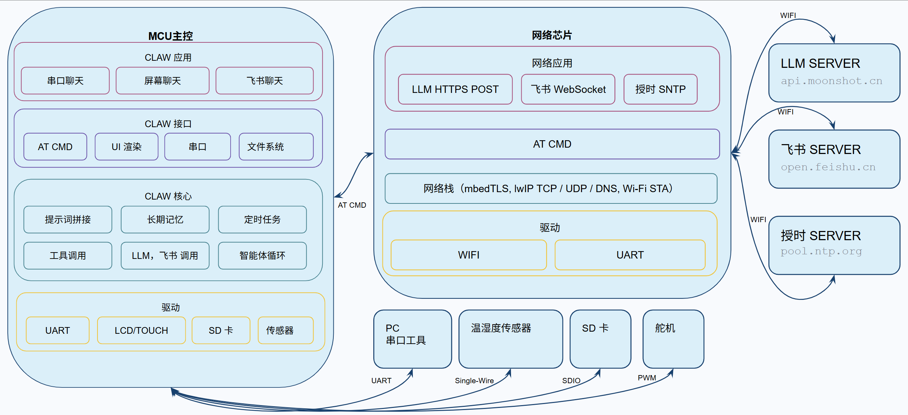

# CLAW 介绍

- CLAW是运行在MCU（RTL8783G）上的AI智能体。

- 整合云端大语言模型、本地的智能体、外设驱动和网络功能，实现完全基于自然语言的MCU应用

- 通过飞书、板载屏幕或者串口终端来聊天

- 智能体能够操作外设（灯、SD卡、传感器）和操作系统（定时任务、监测信号），有长期记忆，知晓自己和用户的身份

## 示例展示

### 检测空气并记录日记

CLAW通过多次循环工具调用
- 理解了空气检测目前的运行环境只能检测温湿度
- 执行温湿度读取并拿到读取结果
- 根据读取结果总结为自然语言
- 执行SD卡新建文件和写入操作，写入空气检测结果
- 拿到SD卡操作结果，总结为自然语言答复

### 控制灯带

- CLAW学习了系统提示词里的灯带控制语法
- 生成灯带控制指令
- 分析指令执行结果
- 用自然语言答复了预期的控制效果

<video src="彩虹灯带.mp4" controls width="100%"></video>

### 知晓身份

- CLAW通过角色文件知晓了自己的身份和运行环境
- 聊天内容同时在飞书和本地屏幕显示

### 检测湿度并警告

CLAW通过多次循环工具调用
- 学习了灯和监视器的使用方法
- 设置了监视器，
- 用自然语言答复了设置监视器成功

视频里通过喷雾触发了湿度警告（亮灯）

<video src="喷雾.mp4" controls width="100%"></video>

### 长期记忆

## CLAW 核心

智能体循环
从聊天记录可以看到CLAW经常有多次cycle的代码回复，最后才能有通顺自然语言回复，这是CLAW相对于单独的大语言模型的一个重要优势，是能够执行复杂任务的核心流程

其中的提示词拼接内容：
- 用户输入
- 角色文件
- 长期记忆
- 本次聊天历史
- 工具调用语法
- 可能有工具执行结果

## 架构说明

- 充分利用板载芯片和外设的能力，实现了与LLM服务器、与飞书服务器的通信，智能体核心循环，工具指令调用等功能，支撑了CLAW的实现；

